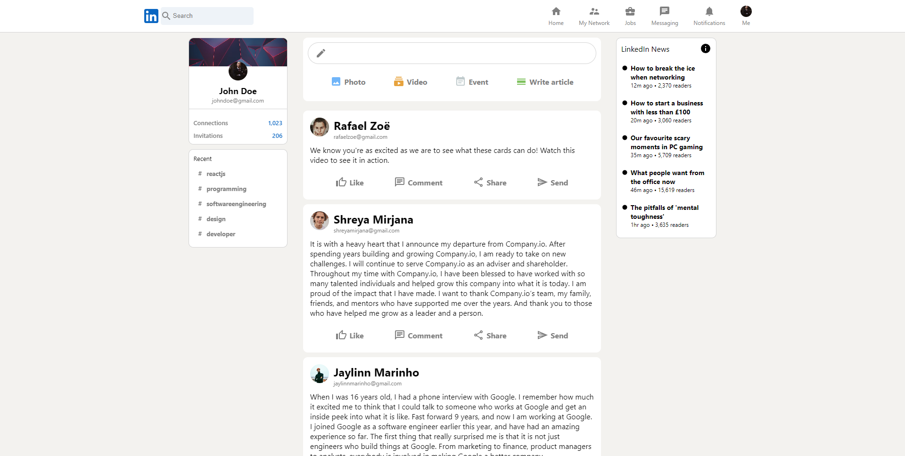
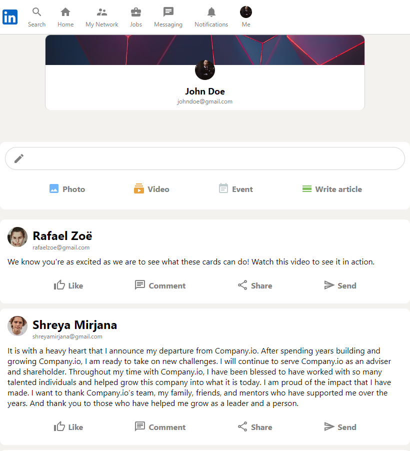
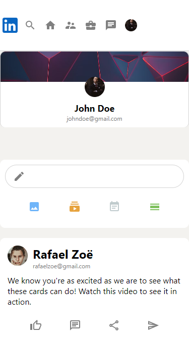

# Overview

Credit to Sonny Sangha: https://www.youtube.com/watch?v=QaYts9sPmcY

This app was built using React and Redux to build the UI which includes a Firebase backend to allow users to login, create and view posts. Other libraries used on this site include Material Icons (https://mui.com/material-ui/material-icons/) and React Flip Move (https://github.com/joshwcomeau/react-flip-move) to add animation to the posts.

Whilst the guide shows how to build the site using the JavaScript version 8 Firebase SDK, I've migrated the code to version 9 using the docs (https://firebase.google.com/docs/reference/js).

I've also added support for responsiveness by converting the style rules (which initially used pixels) to relative units and creating additional styling on smaller screens (e.g. tablet and mobile screens).

